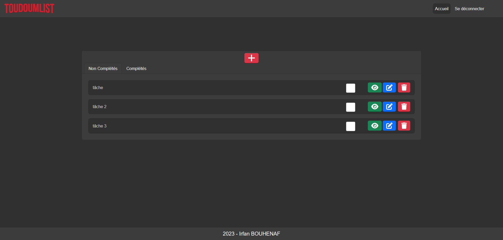

# ToudoumList



## Présentation

Cette application est un gestionnaire de tâches simple qui utilise Angular pour la partie frontend et ExpressJS pour la partie backend. La base de données utilisée est MongoDB.

L'application offre les fonctionnalités suivantes :

* Création de tâches
* Affichage de la liste des tâches
* Marquage de tâches comme terminées
* Suppression de tâches
* Authentification grâce à un email et un mot de passe

Elle est composée de deux répertoires :

* Un dossier appelé "back" contenant le serveur NodeJS
* Un dossier appelé "front" contenant l'application côté client.
# Installation

## Cloner le dépôt Git

```git clone https://github.com/MagicIrfan/ToudoumList.git```

## Installer les dépendances

```npm install```

## Lancer l'application

### Coté serveur

```nodemon server```

### Coté client

```ng serve```


L'application sera accessible à l'adresse http://localhost:4200

## Technologies utilisées

* Angular
* ExpressJS
* MongoDB
* Bootstrap
